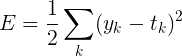

# 챕터 4 : 신경망 학습

`훈련 데이터`와 `시험 데이터`를 나눈다. -> `오버피팅`된 모델을 피하고 `범용 능력`을 제대로 평가하기 위해

## 손실 함수 loss function
비용 함수 cost function 라고도 함

### 평균 제곱 오차 mean squared error, MSE
수식 어떻게 쓰는지 모르겠네  

> [여기서 함](http://latex.codecogs.com/eqneditor/editor.php)  



직관적이당  
한 원소만 1로 그 외는 0 -> `원-핫 인코딩`  

```python
def mean_squared_error(y, t):
    return 0.5 * np.sum((y-t)**2)
```

오차가 더 작은 쪽이 정답에 더 가까울 것이라고 판단 가능

### 교차 엔트로피 오차 cross entropy error, CEE
이걸 더 자주 본 듯


> 별로 직관적으로 와닿진 않는데 `딥러닝 첫걸음`이라는 책에는 좀 더 친절하게 설명되어 있다.  
그 책의 설명을 가져와 보면 신경망의 출력 y가 0에서 1사이여야 하기 때문에 시그모이드, 소프트맥스 활성함수와 같이 사용되는 경우가 많다.  
직관적으로 이해해 보려면 그냥 오차 d-y(딥러닝 첫걸음에서는 정답이 d이다)가 0일 때는 비용함수의 값이 0이고 y가 0에 가까울수록, 즉 오차가 커질수록 비용함수의 값이 급격하게 커진다. (log니까)

하여튼 수식의 설명은 이렇게 얘는 `MSE`보다 같은 오차에 더 민감하게 반응한다는 점이다.  
그래서 회귀 문제와 같은 경우가 아니면 `CEE`가 좋다고 한다.

```python
def cross_entropy_error(y, t):
    delta = 1e-7
    return -np.sum(t * np.log(y + delta))
```
`delta`가 존재하는 이유는 `np.log()`에 0을 전달하면 `-inf`가 튀어나오기 때문에 그렇다.